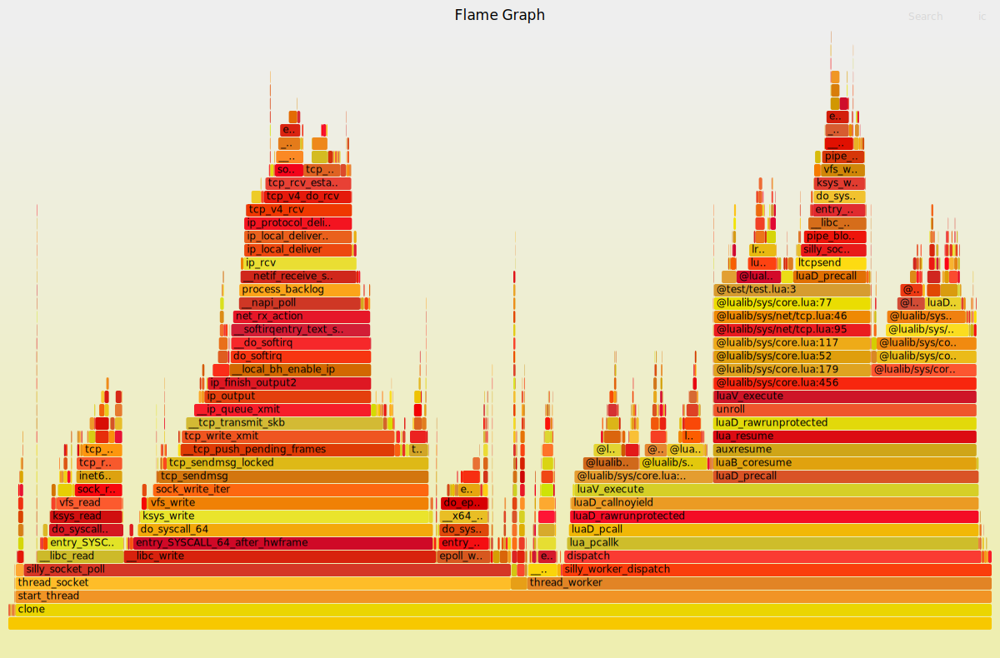

# lua-perf
[](./README.en.md)

`lua-perf`是一个基于`eBPF`实现的性能分析工具，目前仅支持`Lua 5.4`。

## 功能

- 提供对`C`和`Lua`混合代码的性能分析，同时也支持纯`C`代码。
- 采用栈采样技术，并且对目标进程的性能影响非常小，可以在生产环境中使用。
- 通过使用`eh-frame`在内核空间进行栈回溯，不要求目标进程使用`-fno-omit-frame-pointer`选项来保留栈帧指针。

## 执行要求

为了使用`lua-perf`，您需要满足以下要求：

- 安装的`Kernel`版本需要在`5.17`以上。

## 生成火焰图

要生成火焰图，您需要使用`lua-perf`配合[FlameGraph](https://github.com/brendangregg/FlameGraph.git)工具进行操作。以下是步骤：

1. 首先，使用命令 `sudo lua-perf -p <pid> -f <HZ>` 对目标进程进行栈采样，并在当前目录下生成 `perf.fold` 文件。其中 `<pid>` 是目标进程的进程ID，可以是Docker内的进程或者宿主机上的进程。`<HZ>` 是栈的采样频率，默认为 `1000`（即每秒采样1000次）。

2. 然后，使用命令 `./FlameGraph/flamegraph.pl perf.folded > perf.svg` 将 `perf.fold` 文件转换成火焰图。

3. 最后，您就可以在当前目录下找到生成的火焰图 `perf.svg`。

这是一个示例火焰图：



## 日志

在BPF程序中，使用了`bpf_printk`来打印日志, 当你怀疑性能采样结果可能有异常时，您可以通过以下命令来查看日志。

```shell
sudo mount -t tracefs nodev /sys/kernel/tracing
sudo cat /sys/kernel/debug/tracing/trace_pipe
```

## 已知问题

`lua-perf`目前存在以下已知问题：

- 尚不支持`CFA_expression`，在某些极端情况下可能会导致调用栈回溯失败。
- 在分析Lua栈时，目前通过写死寄存器 `rbx` 来寻找 `L` 指针，这对于大多数情况下的 `GCC -O2` 是正确的。但是，根据GCC的优化级别不同，`L` 的值可能存储在不同的寄存器中，这可能导致Lua栈回溯失败。
- 在分析`CFA`指令时，暂时没有处理 `vdso`，因此在 `vdso` 中的函数调用会导致栈回溯失败。
- 在合并进程的C栈和Lua栈时，采用了启发式的合并策略，极端情况下可能存在一些瑕疵（目前尚未发现）。

## 待完成事项

以下是`lua-perf`计划完成的事项：

- 支持`CFA_expression`
- 支持`vdso`
- 动态分析`L`寄存器
- 优化C栈和Lua栈的合并策略
- 支持更多版本的Lua
